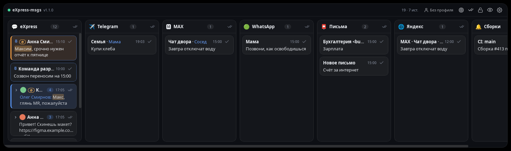
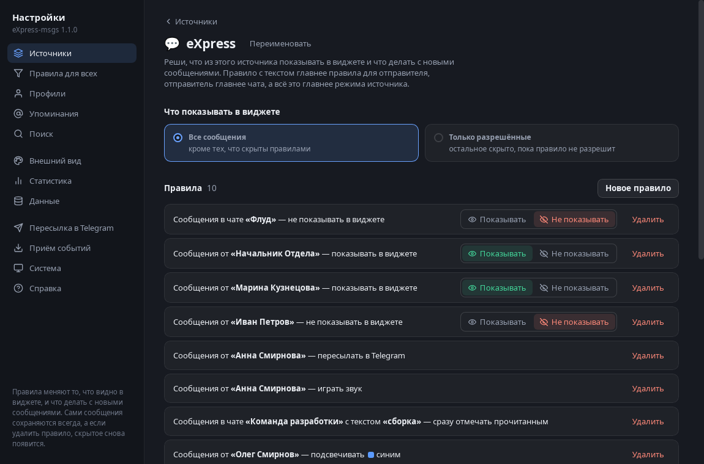

# eXpress-msgs

**Доска уведомлений рабочего стола Linux.** Программа читает уведомления, которые система
и так показывает на экране (мессенджеры, почта, браузер, свои скрипты), сохраняет их в
локальную базу и показывает полупрозрачным виджетом с колонками по источникам — с
правилами «как в почте», поиском и статистикой. Всё работает на твоём компьютере.

[English version](README.en.md)



## Что умеет

- **Собирает** штатные уведомления (D-Bus `org.freedesktop.Notifications`): eXpress, Telegram,
  MAX и другие сайты в браузере (разносит по сайтам), почту, календарь, свои события.
- **Виджет**: колонки по источникам, сообщения одного чата сворачиваются в одну плашку,
  аватары, упоминания твоего имени, ссылки открываются в браузере, двойной клик копирует
  текст, клик по имени — переход в приложение.
- **Разбор входящих**: прочитать сообщение, чат, колонку или всё (с кнопкой «Вернуть»),
  отложить на час, до вечера, до утра, закрепить; через сутки сообщение прочитывается само.
- **Правила «как в почте»**: по источнику, чату, отправителю и тексту (в том числе регулярным
  выражением) — показать, скрыть, подсветить, сразу прочитать, закрепить, звук, переслать
  в Telegram. **Профили** («Работа», «Дом») со сменой по расписанию.
- **Поиск** по всей истории; по желанию — **умный поиск (RAG)** по смыслу и ответы на вопросы
  по переписке через локальную Ollama.
- **Статистика**, недельный отчёт, резервные копии, выгрузка в CSV/JSON, приём событий по HTTP,
  хук «долгая команда в терминале завершилась», самодиагностика, русский и английский интерфейс.



## Установка

Нужны Linux с GNOME или другим рабочим столом со службой уведомлений, Python 3.9+,
GTK 3 и WebKit2GTK 4.1 с GObject-интроспекцией. Ubuntu/Debian:

```bash
sudo apt install python3-gi gir1.2-gtk-3.0 gir1.2-webkit2-4.1 gir1.2-wnck-3.0 dbus-bin libnotify-bin
git clone <адрес репозитория> express-msgs && cd express-msgs
./install.sh                    # проверит зависимости, включит автозапуск и запустит
./install.sh --terminal-hook    # плюс карточки о долгих командах терминала
```

Установщик ставит юниты `systemd --user` (sudo не нужен): сбор уведомлений и виджет стартуют
при входе в систему. Страница: <http://127.0.0.1:8765>, настройки — шестерёнка в виджете.

**Обновление:** `git pull && ./install.sh` — виджет сам перезагрузит страницу с новой версией.
**Удаление:** `./uninstall.sh` (данные останутся) или `./uninstall.sh --purge`.

### Telegram Desktop

По умолчанию Telegram на Linux показывает свои всплывающие окна мимо системы — их не видит
никакая программа. Включи в Telegram «Настройки → Уведомления и звуки → Взаимодействие с
системой → **Использовать системные уведомления**». Подробности — в «Справке» внутри программы.

### Wayland

Полностью программа работает в сеансе X11. В Wayland виджет двигается и тянется мышкой, но
место после перезапуска не восстанавливается, окно не держится под другими, а переход в
приложение идёт через его ярлык: это ограничения самого Wayland для приложений.

## Приватность

Данные не покидают компьютер: база — `~/.local/share/express-msgs`, настройки — `~/.config/express-msgs`,
отдельно от кода. Программа не читает данные приложений — только уведомления, которые ты и так
видишь на экране. Наружу уходит только то, что ты включишь сам: пересылка в Telegram по правилу
и недельный отчёт. Умный поиск работает через локальную Ollama.

## Разработка

Только стандартная библиотека Python (плюс GTK/WebKit через `gi` для окна виджета).

```bash
python3 collect.py              # сбор + страница без установки (Ctrl+C — остановить)
python3 widget.py               # окно виджета
cd tests && python3 -m unittest discover -s . -t .    # тесты
```

Как устроен код и как предлагать изменения — в [CONTRIBUTING.md](CONTRIBUTING.md), история —
в [CHANGELOG.md](CHANGELOG.md).

## Лицензия

[Apache License 2.0](LICENSE). Пользоваться, изменять и распространять можно, в том числе в
составе других программ, **при обязательном сохранении указания авторства** — файла
[NOTICE](NOTICE) — во всех копиях и производных работах.
