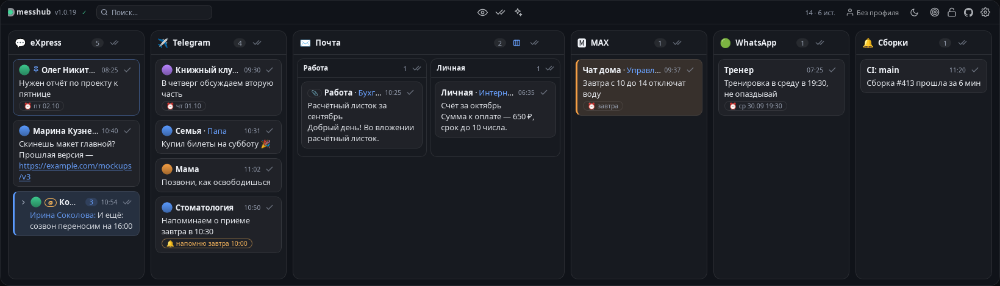
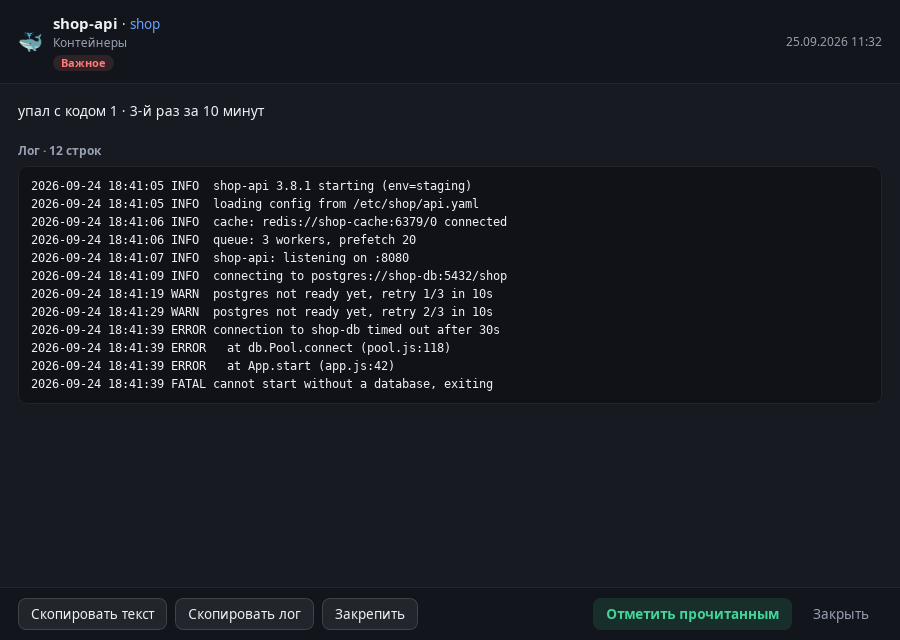
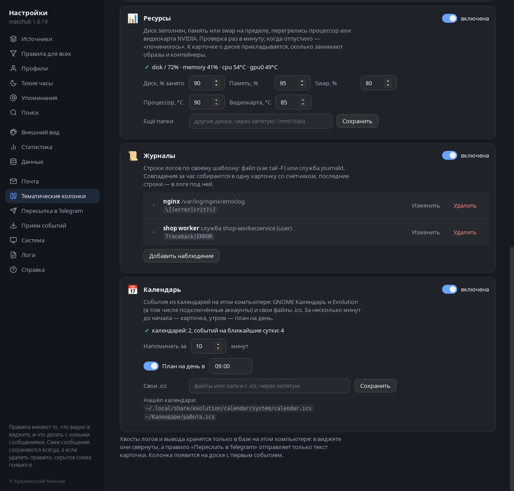
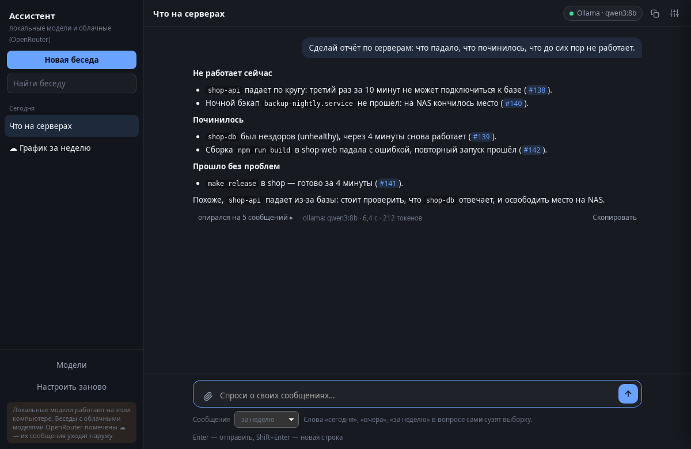
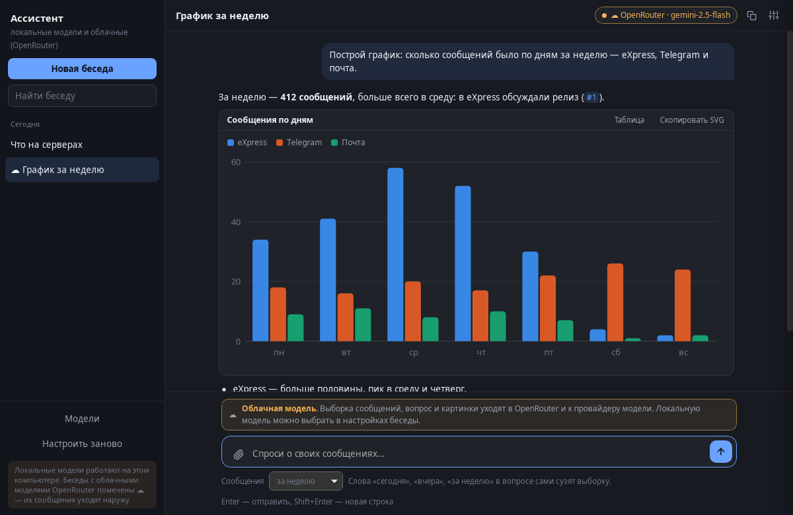
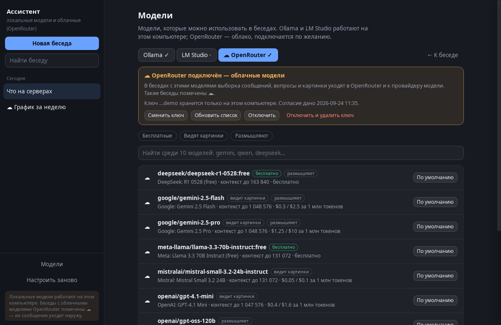
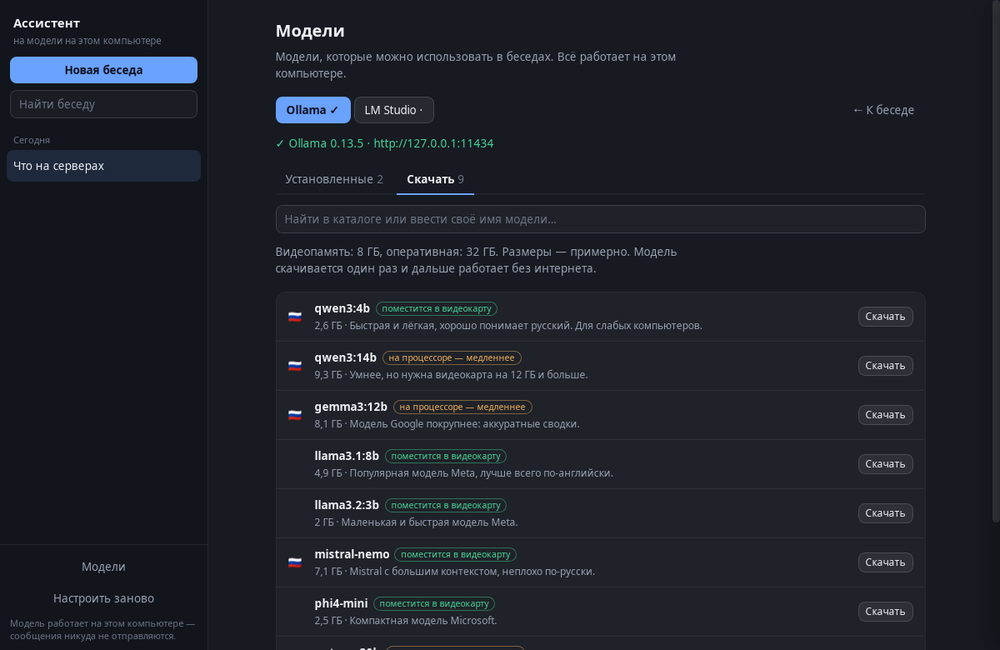
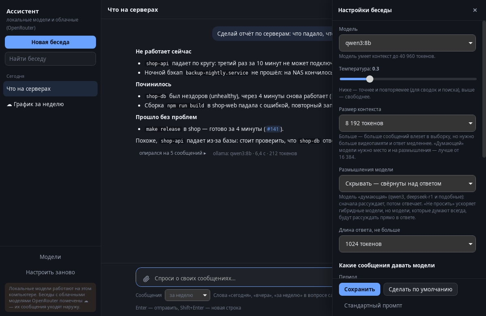
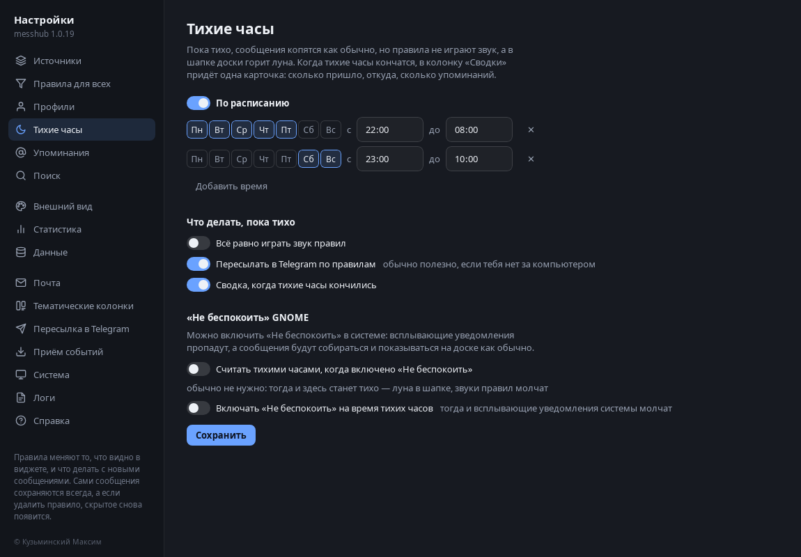

# messhub

**Одно окно для всех уведомлений на компьютере: Linux, а ещё Windows и macOS (бета).**

Сообщения из рабочего мессенджера, Telegram, MAX, WhatsApp, почты и твоих скриптов собираются
на одну аккуратную доску на рабочем столе. Всплывашка исчезла - сообщение осталось. И ничего
не уходит с твоего компьютера.

> 🔒 **Всё остаётся на твоём компьютере.** messhub не отправляет твои сообщения никуда: ни на свои
> серверы (их нет), ни в облако, ни в аналитику. База лежит в папке пользователя, обработка и поиск -
> на месте. Наружу уходит только то, что ты сам включишь в настройках.

[English version](README.en.md)


*На всех картинках - вымышленные люди и сообщения.*

## Откуда идея

Когда работаешь за компьютером, уведомления летят со всех сторон: рабочий чат, семейный Telegram,
домовой чат, почта, сообщения о сборках. Каждая всплывашка висит пару секунд и пропадает. Отошёл
на обед, сидел на созвоне, был занят другим окном - и уже непонятно, что пропустил. Приходится по
очереди открывать каждое приложение и листать.

messhub вырос из простой мысли: компьютер и так показывает мне все эти уведомления - пусть он их
ещё и запоминает. Складывает в одно место, раскладывает по приложениям и не даёт важному утонуть
в потоке. Без облака и без доступа к самим перепискам - только то, что и так было на экране.

## Какие проблемы решает

- **«Что я пропустил?»** Всё, что пришло, пока тебя не было, лежит на доске, пока ты сам не
  отметишь «прочитано». Через сутки старое убирается само.
- **Десять приложений вместо одного окна.** Не нужно открывать каждое, чтобы проверить, нет ли
  нового: одна доска, колонка на приложение.
- **Важное тонет в шуме.** Правила как в почте: болтливый чат спрятать, сообщения руководителя
  закрепить, упоминания твоего имени подсветить, на срочное - звук.
- **Показ экрана на созвоне.** Доска размывается сама, как только начинается демонстрация (или
  одной кнопкой), чтобы коллеги не прочитали лишнего.
- **«Спросить свои сообщения».** Ассистент на модели на твоём же компьютере: «что я пропустил?»,
  «кто спрашивал про отчёт?», «сделай сводку по чату», «построй график по дням» - с номерами
  сообщений в ответе.
- **Сроки теряются в переписке.** «Созвон завтра в 10», «отчёт к пятнице» - на плашке появляется ⏰,
  по клику напоминание придёт вовремя. Тихие часы - ночью и в выходные без звуков.
- **Не хочется отдавать переписку сервисам.** Всё хранится и обрабатывается на твоём компьютере.
  Наружу уходит только то, что ты сам включишь (например, пересылку важного в Telegram).
- **Для тех, кто в ИТ: упал контейнер, служба или сборка.** Тематические колонки ловят падения
  Docker и Podman, упавшие службы и итоги команд - с хвостом лога прямо на карточке. Когда всё
  снова работает, карточка сама отмечается «починилось».

## Как это выглядит

### Доска на рабочем столе

Полупрозрачное окно внизу экрана. Его можно двигать и растягивать мышкой, а замком - закрепить
на месте и спрятать под остальные окна. На каждой плашке:
✓ - прочитано, ⏰ - отложить, 📌 - закрепить, ⓘ - «почему так?», ⤢ - открыть целиком. Клик по
имени открывает приложение, двойной клик по тексту копирует сообщение, ссылки открываются в браузере.

**Длинное сообщение или большой лог** - на плашке видно до 10 строк и ссылка «Показать целиком».
Она (или ⤢ на плашке) открывает сообщение в отдельном окне, как настройки: полный текст и весь лог,
их можно скопировать, закрепить сообщение или отметить прочитанным. Закрывается по Esc.

**Отложить на потом** - сообщение исчезнет и вернётся через час, вечером или завтра утром.


**«Почему так?»** - видно, какое правило подсветило, закрепило или спрятало сообщение.


**Закрыть колонку** - её сообщения станут прочитанными, а сама колонка вернётся, как только придёт
новое. Можно и скрыть её насовсем.


**Подколонки** - если в колонку приходит из нескольких сайтов или программ (браузер с разными вкладками,
почта из нескольких ящиков, MAX и в браузере, и приложением), кнопка в шапке колонки делит её на
подколонки - у каждой свой счётчик и «прочитать всё». Вторым нажатием они собираются обратно.



**Режим фокуса** (клавиша F) - только важное: закреплённое, подсвеченное и упоминания.


**Размытие для показа экрана** (клавиша B).


**Светлая тема**, прозрачность и размер текста - в настройках.


### Тематические колонки для ИТ

Включаются в настройках, каждая отдельно, по умолчанию выключены. Обычному пользователю они не
мешают, а тем, кто работает с кодом и серверами, экономят походы в терминал.

- **Контейнеры** - Docker и Podman: контейнер упал, не хватило памяти, healthcheck «нездоров»,
  перезапускается по кругу. Программа только слушает события движка - ничего не запускает и не
  останавливает.
- **Службы** - упавшие службы systemd (не прошёл таймер бэкапа, не запустился сервис), на Windows -
  службы из журнала событий.
- **Команды** - `messhub run -- make build`: команда идёт как обычно, а итог с кодом выхода и
  хвостом вывода ложится на доску. Удачный повторный запуск гасит прошлую ошибку.
- **Ресурсы** - диск заполнен, память или swap на пределе, перегрелись процессор или видеокарта.
  К карточке о диске прикладывается, сколько занимают образы и контейнеры.
- **Журналы** - строки логов по своему шаблону: файл (как `tail -F`) или служба journald.
  Совпадения за час собираются в одну карточку со счётчиком.
- **Календарь** - события из GNOME Календаря, Evolution и своих `.ics`: карточка за несколько минут
  до начала и план на день утром.
- **Свои источники** - скрипт в папке `sources.d` печатает JSON-строки, и они становятся карточками.
  Новая колонка без правки программы.

Когда проблема ушла, карточка бледнеет и получает «✓ починилось». Хвост лога свёрнут под карточкой
и хранится только у тебя: в Telegram по правилу уходит лишь текст карточки. Свои скрипты могут
делать так же через «Приём событий» (поля `key` и `status: "resolved"`).







### Ассистент на модели на твоём компьютере

Кнопка ✨ в шапке доски открывает отдельное окно, как настройки. Спрашиваешь своими словами, а
ассистент собирает подходящие сообщения из базы и отвечает моделью на этом же компьютере - через
[Ollama](https://ollama.com) или [LM Studio](https://lmstudio.ai). Номера вида #123 в ответе
открывают само сообщение.

- **Первый запуск** - мастер сам найдёт Ollama и LM Studio и покажет установленные модели.
  Для Ollama модель можно скачать прямо в окне: вкладки «Установленные» и «Скачать», поиск по
  каталогу, любое имя из ollama.com/library или с Hugging Face, подсказка, поместится ли модель в
  видеокарту, прогресс скачивания.
- **Беседы** - слева список, у каждой свои настройки: модель, температура, размер контекста,
  длина ответа, какие сообщения брать (период, источники, прочитанные, логи) и свой системный
  промпт. Готовые вопросы: «Что я пропустил?», «Упоминания и вопросы ко мне», «Сроки и
  договорённости», «Отчёт по серверам».
- **Всё остаётся у тебя** - адрес модели принимается только на этом компьютере (домашняя сеть -
  если явно разрешить), облачные адреса программа не примет.
- **Ответы с кодом, таблицами и графиками** - подсветка кода и JSON с кнопкой «Скопировать»,
  таблицы, списки задач, цитаты. Попроси «построй график» - ответ нарисует столбцы, линии или
  кольцо с подсказками при наведении, переключается в таблицу и копируется как SVG.
- **Картинки к вопросу** - скрепка, вставка из буфера или перетаскивание (до 4 штук); для моделей,
  которые видят картинки (gemma3, qwen2.5vl, llava и подобные).
- **OpenRouter - по желанию и на свой страх и риск.** Сотни облачных моделей по своему ключу
  (часть бесплатно). Подключается только вручную: ключ, галочка согласия и жёлтое предупреждение,
  что выборка сообщений, вопрос и картинки уйдут на серверы OpenRouter и компании, чья это модель.
  Облачные беседы помечены ☁ и жёлтой плашкой над полем ввода, локальные работают как раньше.
  Ключ хранится только на этом компьютере в файле с доступом только для тебя.











### Настройки

Открываются шестерёнкой в углу доски.

**Источники** - все приложения, от которых приходили уведомления. Любой можно переименовать
и дать свой значок.


**Источник** - кто писал и что показывать. У каждого чата и отправителя видно, попадает ли он
на доску, и одной кнопкой можно создать для него правило.


**Правило «как в почте»** - условие (чат, отправитель, слова в тексте) и что делать: показывать,
скрыть, подсветить цветом, сразу считать прочитанным, закрепить, проиграть звук, переслать в
Telegram.


**Правила для всех** - действуют сразу на все приложения: например, звук на слово «срочно».


**Профили** - наборы правил: «Работа» в будни днём, «Дом» вечером и в выходные. Включаются
вручную или сами по расписанию.


**Тихие часы** - по расписанию (интервал может идти через полночь) или вручную из шапки доски («тихо
на час», «до утра»). Пока тихо, правила не играют звук, а потом приходит одна сводка: сколько пришло
и откуда. Это своё состояние программы: можно включить «Не беспокоить» в системе - всплывашки
пропадут, а сообщения будут собираться и видны на доске как обычно. По желанию тихие часы можно
связать с «Не беспокоить» в обе стороны.



**Упоминания** - твоё имя и прозвища: такие сообщения подсвечиваются и видны в режиме фокуса.


**Поиск** по всей истории, в том числе по прочитанному и скрытому. Найденное можно вернуть на
доску. По желанию - умный поиск по смыслу и ответы на вопросы («когда переносили созвон?»)
через нейросеть, которая работает на твоём же компьютере.


**Внешний вид** - язык, прозрачность, размер текста, тема, плотность, аватары.


**Статистика** - кто пишет больше всех, какие чаты самые шумные (и кнопка «скрыть» прямо рядом),
в какие часы приходит больше всего сообщений.


**Данные** - сколько хранить историю, ежедневные резервные копии с восстановлением в один клик,
выгрузка в таблицу (CSV) или JSON.


**Почта** - два способа на выбор: брать уведомления почтовых программ или проверять ящики
напрямую (Яндекс, Mail.ru, Gmail, Outlook, iCloud или свой сервер). Ящиков - сколько угодно;
письма на сервере при этом остаются непрочитанными.


**Пересылка в Telegram** - важное по правилу уходит тебе в Telegram, когда ты не за компьютером.
Там же - недельный отчёт: сколько и откуда пришло, самые шумные чаты.


**Приём событий** - скрипты, сборки, умный дом или другой компьютер могут присылать карточки на
доску по сети, с ключом.


**Система** - программа сама проверяет, всё ли работает, и подсказывает, что поправить. Тут же -
автозапуск при входе в систему.


**Логи** - журнал самой программы: запуск, ошибки, фоновые задачи. Фильтр по важности, поиск,
очистка и выгрузка в файл - домашняя папка в выгрузке заменяется на «~», так что её можно
приложить к сообщению об ошибке. Тексты сообщений в журнал не пишутся.


**Справка** - инструкции: как подружить Telegram, как слать свои события, что с Wayland.


## Установка

Все файлы - на странице [выпусков](https://github.com/DanielLetto2020/messhub/releases/latest). Выбери
свою систему. Права администратора нужны только для пакетов Linux (их ставит менеджер пакетов).

| система | файл | коротко |
|---|---|---|
| Ubuntu, Debian, Mint и другие на Debian | `messhub_<версия>_all.deb` | `sudo apt install ./messhub_*_all.deb` |
| Fedora, openSUSE, RHEL-подобные | `messhub-<версия>-1.noarch.rpm` | `sudo dnf install ./messhub-*.noarch.rpm` |
| любой другой Linux | `messhub-<версия>.tar.gz` | распаковать и `./install.sh` |
| Windows 10 / 11 (бета) | `messhub-<версия>-windows-x64.msi` | двойной щелчок - обычная установка |
| Windows 10 / 11 (бета) | `messhub-<версия>-windows-setup.bat` | установка без установщика |
| Windows 10 / 11 (бета) | `messhub-<версия>-windows-portable.zip` | переносная версия, без установки |
| macOS 14+ на Apple Silicon (бета) | `messhub-<версия>-macos-arm64.dmg` | открыть и перетащить в «Программы» |
| macOS 14+ на Apple Silicon (бета) | `messhub-<версия>-macos-arm64.zip` | то же приложение архивом |
| для проверки | `SHA256SUMS.txt` | контрольные суммы всех файлов |

### Linux

Нужен рабочий стол GNOME (Ubuntu, Fedora, Debian, Mint и другие); лучше всего - сеанс «GNOME on Xorg».

**Ubuntu, Debian, Mint - пакет `.deb`**

```bash
sudo apt install ./messhub_*_all.deb        # в папке, куда скачал файл; зависимости подтянутся сами
```

**Fedora, openSUSE - пакет `.rpm`**

```bash
sudo dnf install ./messhub-*.noarch.rpm     # Fedora
sudo zypper install ./messhub-*.noarch.rpm  # openSUSE
```

После пакета запусти **messhub** из меню приложений (или командой `messhub`): доска появится внизу
экрана и дальше будет запускаться сама при входе в систему. Настройки - шестерёнка в её углу.
Обновить - поставить новый пакет поверх; удалить - `sudo apt remove messhub` / `sudo dnf remove messhub`
(история остаётся в `~/.local/share/messhub`).

**Любой другой Linux - архив `.tar.gz`**

```bash
tar -xzf messhub-*.tar.gz
cd messhub-*/
./install.sh            # проверит, чего не хватает, и подскажет команду для твоего дистрибутива
```

Программа ставится только для тебя, без sudo, и запускается сама при входе в систему.
Удалить - `./uninstall.sh` (история останется) или `./uninstall.sh --purge` (удалить и её).

**Из исходников (для тех, кто хочет свежий код)**

```bash
sudo apt install git python3-gi gir1.2-gtk-3.0 gir1.2-webkit2-4.1 gir1.2-wnck-3.0 dbus-bin libnotify-bin
git clone https://github.com/DanielLetto2020/messhub.git
cd messhub
./install.sh            # обновить потом: git pull && ./install.sh
```

### Windows 10 и 11 (бета)

**Установщик `.msi`** - скачай и запусти двойным щелчком. Права администратора не нужны: программа
ставится для тебя в `%LOCALAPPDATA%\Programs\messhub`, появляется в меню «Пуск» и запускается вместе
с Windows. Удалить - «Параметры → Приложения → messhub → Удалить».

**Установка через `.bat`** - скачай `messhub-…-windows-setup.bat` и запусти двойным щелчком: он сам
скачает переносную версию, поставит её туда же и создаст ярлык. Удалить - запустить тот же файл с
ключом `/uninstall` (в командной строке: `messhub-…-windows-setup.bat /uninstall`).

**Переносная версия `.zip`** - распакуй в любую папку (хоть на флешку) и запусти `messhub.exe`. База и
настройки лежат рядом, в папке `data`. Удалить - просто удалить папку.

При первом запуске Windows спросит, можно ли messhub читать уведомления, - разреши (если отказался:
«Параметры → Конфиденциальность и защита → Уведомления»). Нужен движок WebView2 - он уже есть в
Windows 11 и в обновлённой Windows 10. Программа пока не подписана сертификатом, поэтому Windows
может предупредить «Неизвестный издатель»: «Подробнее → Выполнить в любом случае». Windows 7 не
поддерживается: в ней нет системного центра уведомлений. Версия для Windows новая - если что-то
не так, напиши в [issues](https://github.com/DanielLetto2020/messhub/issues/new/choose).

### macOS (бета, Apple Silicon)

Нужен Mac на Apple Silicon (M1 и новее) и macOS 14 Sonoma или новее (вплоть до macOS 27 Golden Gate).

**Почему macOS предупредит.** messhub - бесплатная программа с открытым кодом, и платной подписи
Apple (Apple Developer ID, 99 долларов в год) у неё нет. Сборку делает GitHub Actions прямо из этого
репозитория и подписывает её обычной бесплатной подписью (ad-hoc). Поэтому macOS не может проверить
разработчика и один раз спросит тебя - как «Неизвестный издатель» на Windows.

1. Скачай `messhub-<версия>-macos-arm64.dmg`, открой его и перетащи **messhub** в «Программы».
2. Открой messhub из «Программ». macOS скажет, что не удалось проверить messhub на вредоносное ПО, -
   нажми **Готово** (не «Переместить в корзину»).
3. Открой **Системные настройки → Конфиденциальность и безопасность** и прокрути вниз, до раздела
   «Безопасность»: там будет строка о том, что messhub заблокирован, - нажми **Всё равно открыть**,
   введи пароль и ещё раз **Открыть**. Кнопка видна около часа после попытки запуска; если её нет -
   снова открой messhub и вернись в настройки.

   То же одной командой в Терминале, без настроек:

   ```bash
   xattr -dr com.apple.quarantine /Applications/messhub.app
   ```

4. Разреши **Полный доступ к диску** - messhub сам откроет этот раздел («Системные настройки →
   Конфиденциальность и безопасность → Полный доступ к диску»). Включи там messhub (если его нет в
   списке - «+» и выбери messhub в «Программах»), затем закрой и снова открой messhub. Зачем: macOS
   хранит показанные уведомления в своей защищённой базе, а messhub её только читает. В данные самих
   приложений он не заглядывает.
5. Автозапуск при входе в систему - в настройках messhub, раздел «Система».

**Обновление** - перетащи новую версию в «Программы» с заменой и снова пройди шаги 2-4. Без платной
подписи macOS считает каждую версию новой программой, поэтому «Всё равно открыть» и «Полный доступ
к диску» нужно подтвердить заново (в списке доступа сначала убери старый messhub кнопкой «-»).
**Удалить** - перетащи messhub из «Программ» в корзину. История лежит в
`~/Library/Application Support/messhub`, автозапуск - `~/Library/LaunchAgents/messhub.plist`.

Что на Mac пока иначе: попадают уведомления, которые macOS кладёт в Центр уведомлений (если у
приложения уведомления выключены или уведомление смахнули за пару секунд - его не будет); колонка
«Службы» и хук терминала - только для Linux и Windows; «перейти в приложение» открывает само
приложение. Версия для Mac новая - если что-то не так, напиши в
[issues](https://github.com/DanielLetto2020/messhub/issues/new/choose), а журнал из раздела «Логи»
поможет найти причину.

### Проверить скачанное

```bash
sha256sum -c SHA256SUMS.txt --ignore-missing      # Linux: рядом со скачанными файлами
certutil -hashfile messhub-…-windows-x64.msi SHA256   # Windows: сравни с SHA256SUMS.txt
shasum -a 256 messhub-…-macos-arm64.dmg                 # macOS: сравни с SHA256SUMS.txt
```

### Если не видно сообщений из Telegram

Telegram Desktop на Linux по умолчанию показывает свои всплывающие окна мимо системы, и их не видит
никто. Включи в Telegram: **Настройки → Уведомления и звуки → Использовать системные уведомления**.
Там же оставь включённым показ имени и текста.

## Приватность - простыми словами

- messhub видит **только уведомления**, которые компьютер и так показал тебе на экране. В сами
  приложения, их базы и переписки он не заглядывает.
- История хранится **только на твоём компьютере** (`~/.local/share/messhub`, на Mac -
  `~/Library/Application Support/messhub`). Никаких серверов, аккаунтов и аналитики.
- На Mac уведомления берутся из базы Центра уведомлений, которую ведёт сама macOS, - поэтому нужен
  «Полный доступ к диску». messhub только читает эту базу и ничего в ней не меняет.
- С компьютера уходит только то, что ты включишь сам: пересылка важного в Telegram, недельный
  отчёт и проверка твоих почтовых ящиков (только чтение). Умный поиск работает через нейросеть на
  твоём же компьютере.
- Пароли и ключи лежат в файлах, доступных только тебе, и никуда не передаются.
- Страница доски и настроек открыта только для этого компьютера, а чужие сайты в браузере до неё
  не достучатся: сервер отвечает только своим страницам.
- Тематические колонки и журнал программы тоже хранятся только локально. Хвосты логов не
  пересылаются даже по правилу «Переслать в Telegram».
- Ассистент отвечает моделью на этом компьютере (Ollama или LM Studio). Интернет нужен, только
  чтобы один раз скачать модель; адрес модели в облаке программа не примет. Единственное
  исключение - OpenRouter, если ты сам подключишь его своим ключом и согласишься: тогда в беседах с
  облачной моделью (они помечены ☁) выборка сообщений, вопрос и картинки уходят в OpenRouter.
  Выключается одной кнопкой, ключ можно удалить.
- Раз в 12 часов программа спрашивает у GitHub номер последней версии, чтобы показать «есть новая
  версия». О тебе при этом ничего не отправляется; выключается в «Настройки → Система».

## Частые вопросы

**Увижу ли я сообщения, которые пришли, пока компьютер был выключен?** Нет. messhub запоминает то,
что было показано уведомлением. Исключение - почта из подключённых ящиков: новые письма подтянутся
при следующей проверке.

**Почему нет сообщений из чата, который у меня открыт?** Приложения не показывают уведомления для
чата, на который ты уже смотришь (Telegram - пока его окно открыто на этом чате), - значит, и
запоминать нечего. Достать такие сообщения можно было бы только из данных самого приложения, а туда
messhub не заглядывает. Переключись на другое окно - и новые сообщения этого чата снова придут
уведомлениями.

**Иногда приходит только начало длинного сообщения.** Так его показало само приложение: в
уведомление часто попадает лишь начало текста, а вместо вложений - «фото» или «файл».

**Работает ли на Windows или macOS?** Linux - да, Windows 10 и 11 - да (бета), macOS 14 и новее на Apple
Silicon - да (бета). Windows 7 - нет: в ней нет системного центра уведомлений, который можно читать.

**Почему в колонке браузера всё вместе?** На Linux и Mac браузер пишет в уведомлении сайт - по нему
сообщения расходятся по своим колонкам (MAX, WhatsApp, Почта и т.д.). На Windows сайт видно только
на самой всплывашке, программам Windows его не отдаёт (проверено), поэтому там всё из Chrome - в
одной колонке. Если в колонку приходит из нескольких сайтов или программ, её можно разделить на
подколонки кнопкой в шапке колонки.

**А на Wayland?** Работает, но с ограничениями самого Wayland: доска не запоминает место на экране
и не умеет держаться под другими окнами. Подробнее - в «Справке» внутри программы.

**Нужна ли нейросеть?** Нет. Всё, кроме умного поиска, работает без неё. Умный поиск включается в
настройках, если захочешь.

## Для разработчиков

Программа написана на Python без внешних зависимостей (GTK и WebKit для окна берутся из системы).
Код программы - в папке `app/`, сборка пакетов - в `packaging/` и `tools/`, тесты - в `tests/`.
Как устроен код и как запустить тесты - в [CONTRIBUTING.md](CONTRIBUTING.md), история версий - в
[CHANGELOG.md](CHANGELOG.md).

**Pull request'ы принимаются только в ветку [`contrib`](https://github.com/DanielLetto2020/messhub/tree/contrib)**:
сделай форк, ветку от `contrib` и открой PR в `contrib`. В `main` попадают только выпуски.
Ошибку или идею можно описать в [issues](https://github.com/DanielLetto2020/messhub/issues/new/choose) -
там готовые формы.

## Лицензия

[Apache License 2.0](LICENSE). Пользоваться, изменять и распространять можно, в том числе в
составе других программ, при одном обязательном условии: **сохранять файл [NOTICE](NOTICE) и
указывать автора строго так: «Кузьминский Максим i@m-letto.ru»** во всех копиях и
производных работах.
